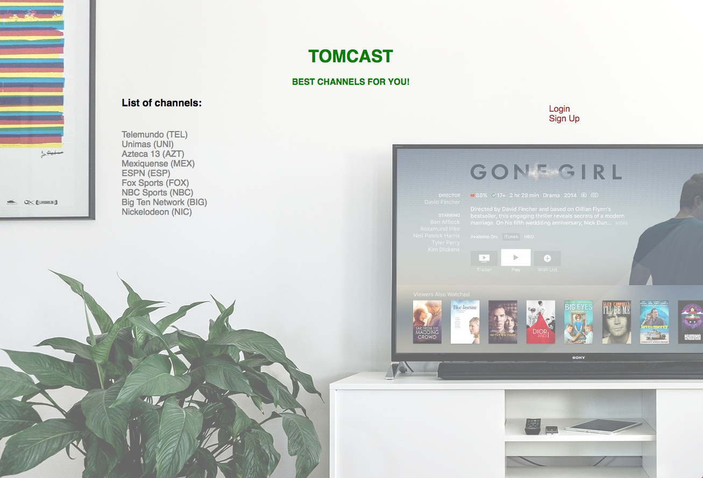

# Channel Subscription Application

### Features:
* Authentication
* Channels (with subscribe/unsubscribe option)
* Profile page (with list of the user's channels and package cost)

### To run it localy:
1.  `clone it`
2.  `bundle install`
3.  `bundle exec rake db:create`
4.  `bundle exec rake db:migrate`
5.  `bundle exec rake db:seed`
6.  `bundle exec shotgun config.ru`
7.  Open [http://localhost:9393](http://localhost:9393)
